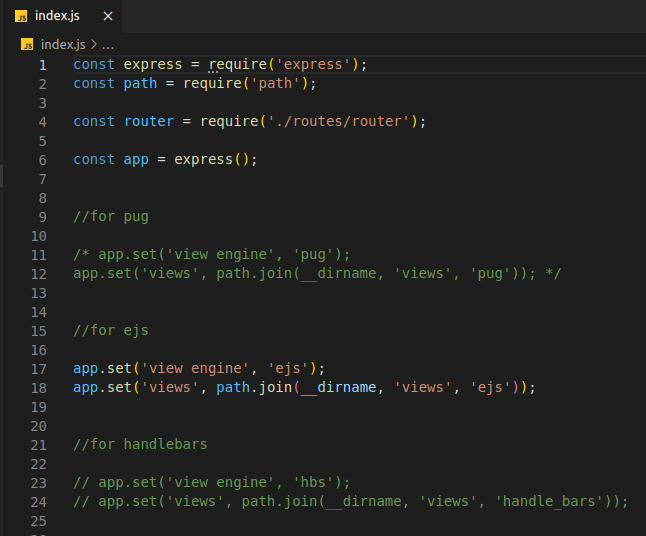
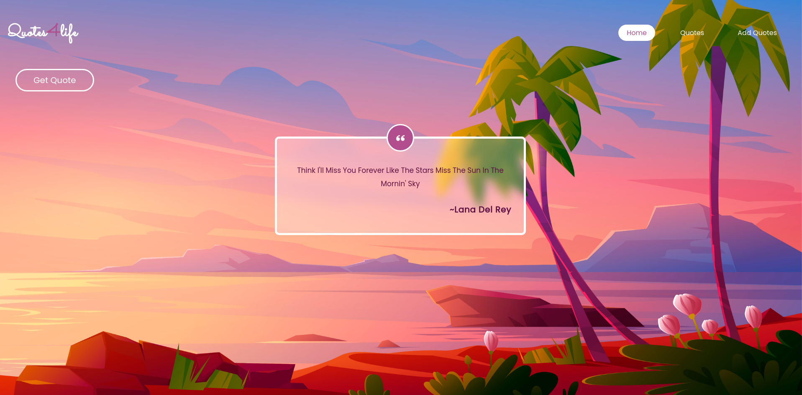
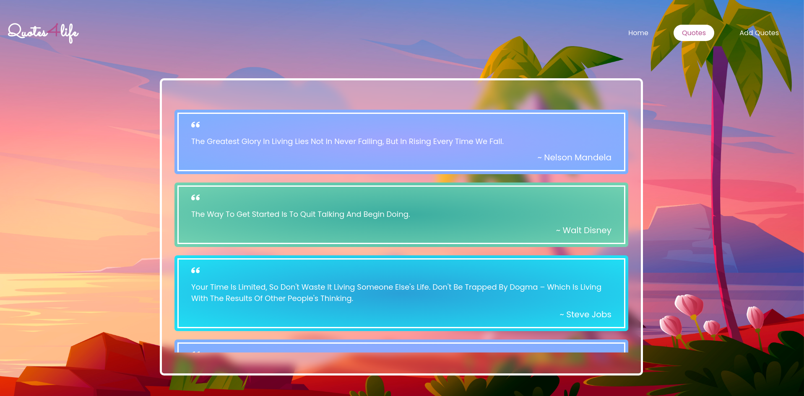
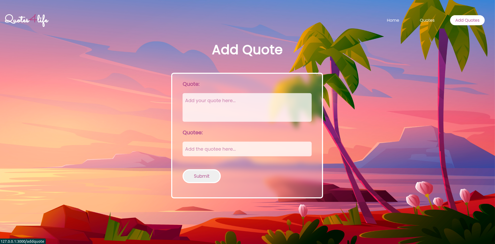
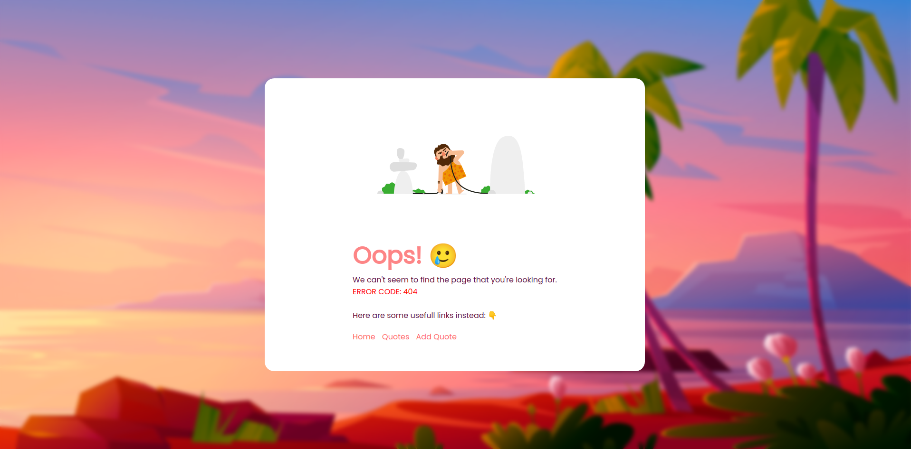
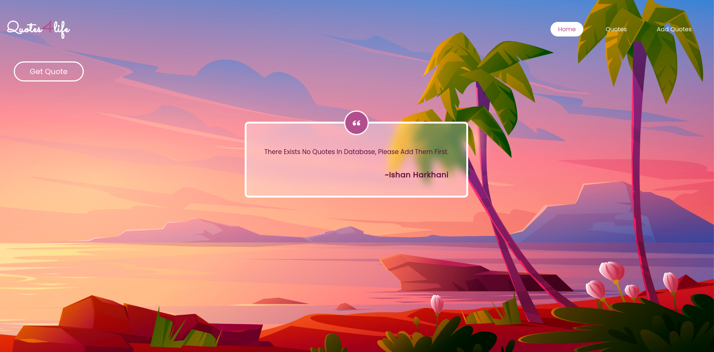
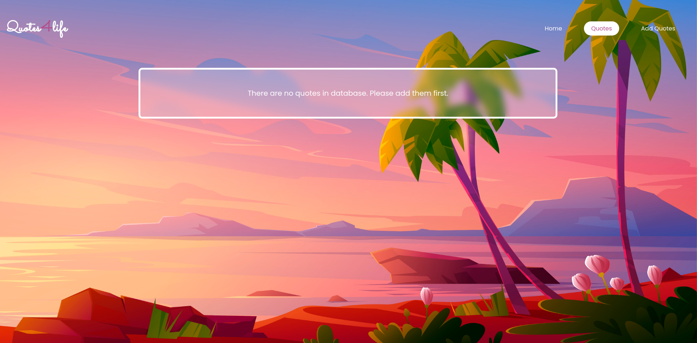

# Templating engines

## 📝 Table of Contents

- [AIM](#aim)
- [Usage](#usage)
- [Output](#output)

 

## 🏁 AIM 

Prepare a quote management app using different type of rendering engines.

 

> ### ⛏️ Dependencies

- Express
- EJS
- Pug
- Handlebars

 

## 🎈 Usage 
Clone the repo using below command: 
<code>$ git clone (web URL)</code> 

 

Then open the terminal and run the below command: 
<code>$ nodemon index.js</code> 

 

and then go to "localhost:3000/home" to see the output.

 

and then you can switch between different <code>app.set()</code> statements to set different rendering engines👇.
  
  

## 🎉 Output 
 

<ol>
    <li>Home Page</li> 
      
    <li>View all quotes Page</li> 
      
    <li>Add quotes Page</li> 
      
    <li>Error Page</li> 
      
    <li>Special cases</li> 
    <ul>
        <li>if there are no quotes then home page</li> 
          
        <li>if there are no quotes then show all quotes page</li> 
          
    </ul>
</ol>

##  ✍️ Author: ISHAN HARKHANI